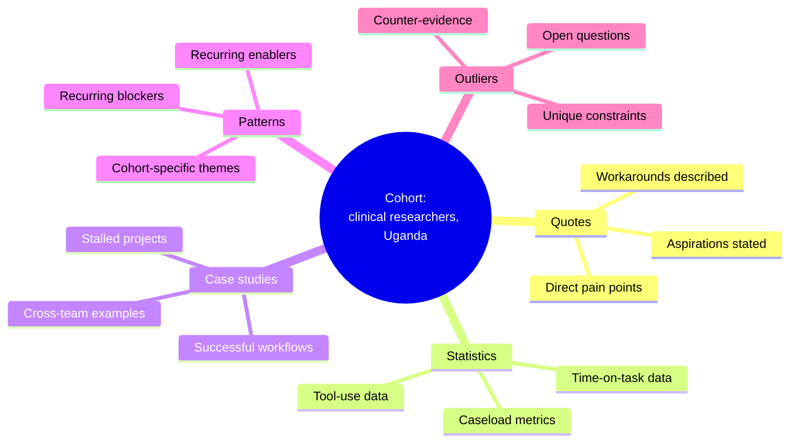
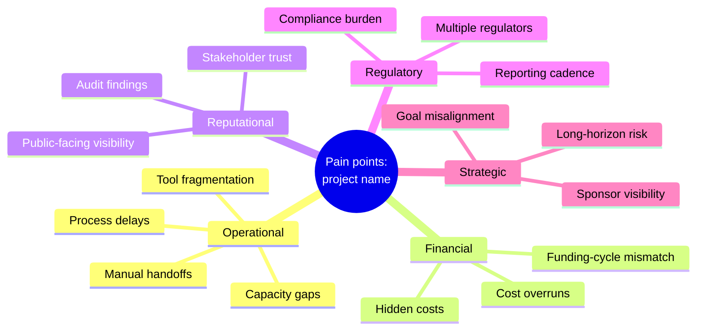
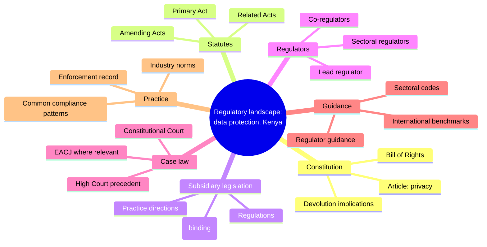
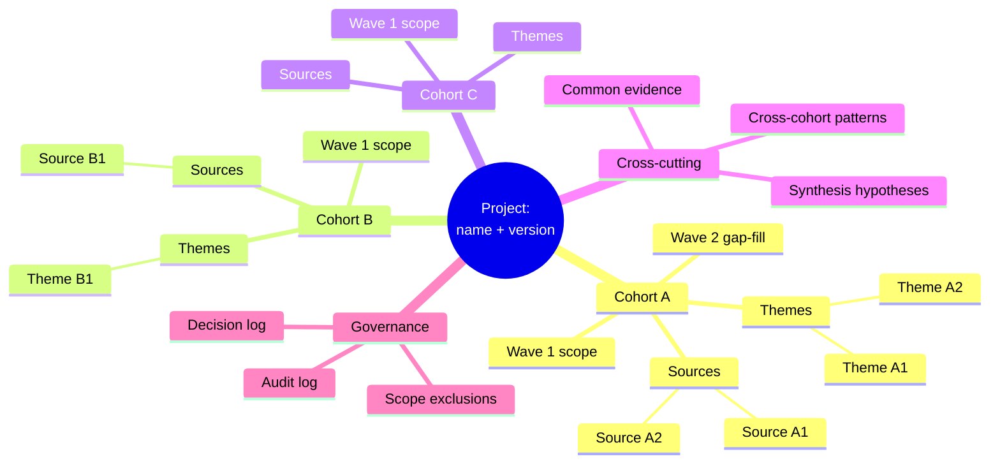

# Mermaid `mindmap` patterns for engine output

**Date written:** 2026-04-27
**Drawn from:** Mermaid's `mindmap` syntax (live in the engine's existing toolchain via `documentation-generation:mermaid-expert`); structure adapted to the use cases of `mind-mapping-and-synthesis`.

This reference is the operational side of the skill: concrete Mermaid templates for the four use cases the engine routinely needs. Copy, adapt, ship.

## Mermaid `mindmap` quick reference

Mermaid's `mindmap` block uses indentation to express hierarchy. The root is declared with `root((Topic))`. Each indented level is a sub-branch.

Limits:

- **No native cross-links.** Branches are strictly hierarchical. Cross-links are documented in a separate prose block beneath the mindmap (see "Cross-links convention" below).
- **Limited styling.** Mermaid 10+ supports class-based styling on mindmap nodes; older renderers may ignore it. Default to legibility over decoration.
- **One root per block.** Re-centring requires a separate `mindmap` block.

For richer notation (cross-edges, conditional flows, swimlanes), consider switching to `flowchart` or delegating to `documentation-generation:mermaid-expert`.

## Cross-links convention

Mermaid `mindmap` does not support cross-edges. The engine convention: list cross-links in a fenced block below the mindmap.

```
Cross-links:
- [Branch A::Sub-node] ↔ [Branch B::Sub-node] — note about the relationship
- [Branch C::Sub-node] → [Branch D::Sub-node] — directional dependency
```

The `::` separator names the path from a main branch to a sub-node, so a reader can locate both ends.

## Pattern 1 — Cohort synthesis map

Use when: a research cohort has produced a body of evidence that needs structuring before cross-cohort synthesis.



```
Cross-links:
- [Patterns::Recurring blockers] ↔ [Statistics::Time-on-task data] — quantitative evidence for the pattern
- [Outliers::Counter-evidence] → [Patterns::Recurring blockers] — bounds the generality of the pattern
```

## Pattern 2 — Pain-point taxonomy map

Use when: pain points across one or more cohorts need a navigable categorisation.



```
Cross-links:
- [Operational::Process delays] ↔ [Regulatory::Reporting cadence] — regulatory cycle drives operational rhythm
- [Financial::Funding-cycle mismatch] ↔ [Strategic::Goal misalignment] — funding shape constrains strategic choice
```

This template is also the natural input to `pain-point-taxonomy` and feeds `cross-cohort-synthesis`.

## Pattern 3 — Regulatory landscape map

Use when: a regulatory landscape needs a single-page navigable overview.



Pairs naturally with a `systems-thinking-and-mental-models` systemigram showing the *flows* between actors. Use both: the mind map for hierarchy, the systemigram for behaviour.

```
Cross-links:
- [Statutes::Primary Act] ↔ [Case law::High Court precedent] — interpretive cases on the statute
- [Regulators::Lead regulator] → [Guidance::Regulator guidance] — guidance source
```

Note: in production, replace placeholder labels with the actual statute / case / regulator names — verified against the live repository per `online-legal-research`.

## Pattern 4 — Research-plan / wave-decomposition map

Use when: a project brief is being decomposed into waves and cohorts.



```
Cross-links:
- [Cohort A::Themes::Theme A2] ↔ [Cohort B::Themes::Theme B1] — same underlying phenomenon
- [Cross-cutting::Synthesis hypotheses] → [Cohort A::Wave 2 gap-fill] — hypothesis directs the next wave
```

This template is the natural artifact for `research-orchestration` planning. Each main branch (Cohort A, B, C…) becomes one sub-agent's brief.

## Style class convention (Mermaid 10+)

Where the renderer supports class styling, the engine convention:

```
classDef evidence fill:#dbeafe,stroke:#1e3a8a;
classDef opportunity fill:#dcfce7,stroke:#14532d;
classDef risk fill:#fee2e2,stroke:#7f1d1d;
classDef insight fill:#fef3c7,stroke:#78350f;
```

| Class | Use for |
|---|---|
| `evidence` | Branches that aggregate sourced facts |
| `opportunity` | Branches that surface action paths |
| `risk` | Branches that flag risks or gaps |
| `insight` | Branches that hold synthesis or judgements |

Apply classes in the mindmap with `:::evidence` etc. on individual nodes where supported; otherwise, omit.

## Rendering options

The engine produces markdown corpora and Word artifacts. Rendering paths:

- **In markdown** — Mermaid block renders inline in any Mermaid-aware viewer (GitHub, VS Code with Mermaid extension, Obsidian, the engine's HTML preview)
- **In Word** — Mermaid does not render natively in Word. Convert to SVG/PNG using `mmdc` (Mermaid CLI) and embed via `python-document-generation`. Keep the Mermaid source in the markdown for traceability.
- **In a slide deck** — same as Word; convert to PNG and embed
- **As OPML** for users who want to load into XMind, MindNode, or similar — generate OPML alongside the Mermaid for those audiences

## Anti-patterns specific to Mermaid mindmap output

- More than ~30–40 nodes in one mindmap — readability collapses; split
- Long sentences in node labels — use short noun phrases; `<br/>` only for the root if essential
- Cross-edges drawn as faked sub-branches — cross-links go in the prose block, not the mindmap
- Treating the Mermaid output as the deliverable when the audience needs prose — re-render to prose for readers, keep Mermaid as the working artifact
- Class styling that depends on a renderer the audience doesn't have
- Failing to include the Mermaid source alongside any rendered SVG/PNG — destroys reproducibility
